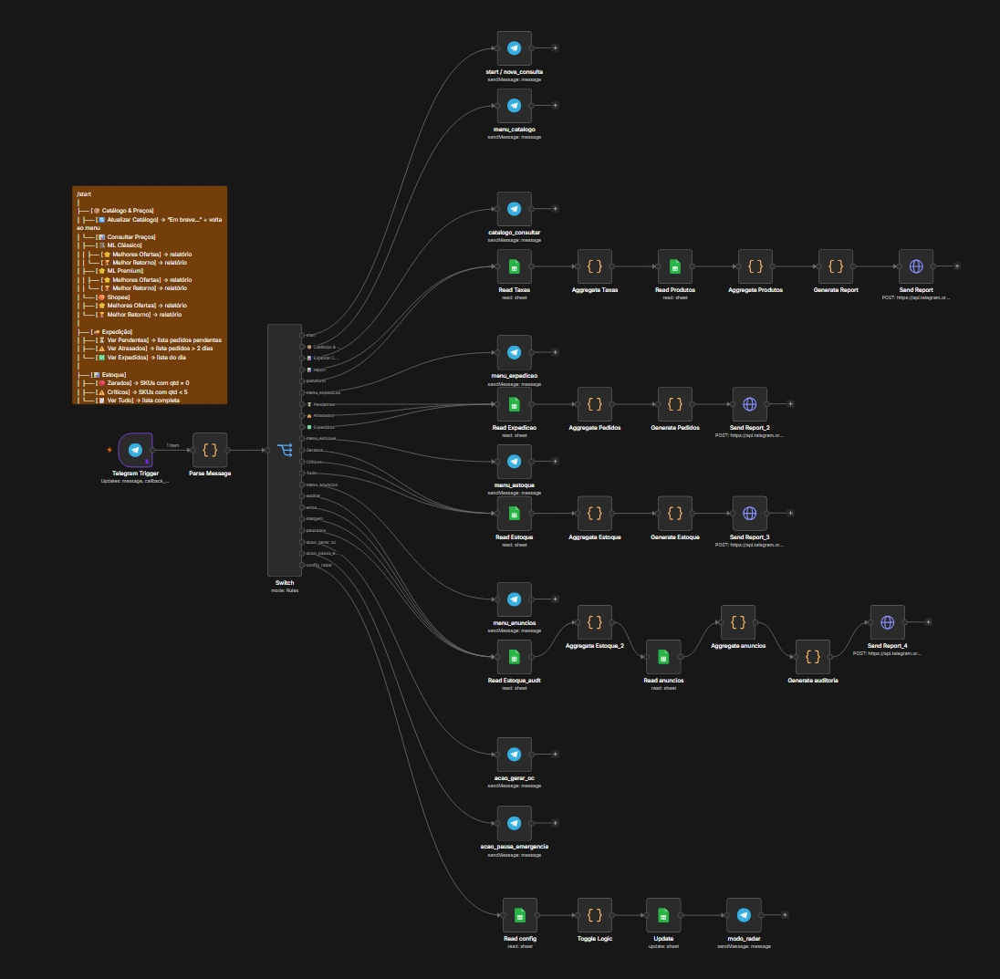
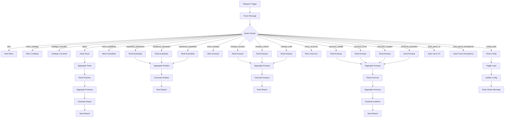

# 🤖 CataPedido: AI-Powered B2B E-commerce Automation


An automated AI workflow built with n8n to process complex PDF catalogs using GPT-4 Vision/OCR, extract unstructured data into CSV, and calculate dynamic B2B e-commerce margins via Telegram.

<p align="center">
  
  <br>
  <sub><em>n8n Workflow</em></sub>
</p>

## 📖 The Story & The Problem

Imagine running a high-volume e-commerce operation, selling electronics on multiple marketplaces like Mercado Livre and Shopee. Your success depends on buying the right products at the right time.

Every week, your overseas suppliers send you a new product catalog. But there's a catch: it's a 30-page PDF document. 

<p align="center">
  
  <br>
  <sub><em>Product Sheet</em></sub>
</p>

To place an order, you have to manually:
1. Scroll through hundreds of items visually.
2. Spot which products are "out of stock" (often indicated only by a visual watermark over the image).
3. Type out the current prices vs. the crossed-out original prices.
4. Open a spreadsheet to calculate complex margins, factoring in the specific commission fees, taxes, and shipping costs of *each* marketplace you sell on.
5. Manually type a WhatsApp message to the supplier formatting your entire order.

This process takes hours, is highly prone to human error, and delays purchasing decisions meaning by the time you figure out what's profitable, the supplier might have already run out of stock.

**The Solution?** An automated n8n workflow that uses GPT-4 Vision to "read" the PDF, extract structured data, calculate margins instantly via Google Sheets, and serve everything through an interactive Telegram Bot.

---

## 🚀 Features & Capabilities

CataPedido acts as a simplified ERP operated 100% via Telegram, focused on preventing losses and accelerating decision-making in E-commerce. Its functions are divided into 4 main pillars:

### 📦 1. Catalog Intelligence (OCR & Pricing)
*   **GPT-4 Vision Extraction:** Reads supplier PDFs and converts complex images (including "out of stock" stamps and crossed-out prices) into structured data.
*   **Dynamic Pricing:** Instantly calculates the minimum selling price by combining the supplier's cost with the specific commission rates and taxes of each platform (Mercado Livre, Shopee, etc.).
*   **Opportunity Ranking:** Generates reports highlighting SKUs with the highest discount % and the best Return on Investment (ROI).

### 🚚 2. Dispatch Monitoring
*   Provides real-time operational status of daily logistics (Pending, Dispatched) for quick auditing.
*   **Delay Alerts:** Highlights orders with delayed shipping (>2 days) to avoid account reputation penalties.

### 📊 3. Inventory Control
*   Allows the user to quickly view the complete warehouse inventory directly from their phone.
*   **Critical Alerts (≤ 5 units):** Displays SKUs about to run out of stock and provides an interactive button to *"Generate Purchase Draft"*.
*   **Stockouts:** Identifies SKUs with zero stock and offers an *"Emergency Pause"* option with one click.

### 📡 4. Radar Mode (Ad Auditing)
A proactive logic layer that cross-references physical inventory with online ads:
*   **Margin Risk:** Identifies and alerts about active ads that are running with a negative margin (causing financial loss).
*   **Integration Audit:** Cross-references databases to find products that have physical stock but were forgotten and are not advertised online.
*   **Paused with Stock:** Finds ads that are paused (e.g., due to a past stockout), cross-references them with the current balance, and provides a button to *Reactivate All*.
*   **Block Filters:** Lists ads that have suffered violations, errors, or platform blocks.

---

## 📈 Business Impact & ROI

By keeping the autonomous "Radar Mode" active 24/7 and automating the catalog OCR extraction, this architecture delivers measurable business results:

*   **Time-to-Market:** Reduced the catalog analysis and purchasing decision process from **4 hours to under 3 minutes**. Fast purchasing ensures the store secures high-demand inventory before suppliers run out of stock.
*   **100% Loss Prevention:** The proactive Margin Radar eliminates human error in pricing. If a marketplace changes its fee structure, the bot immediately flags any active ads running with negative margins, saving thousands of dollars in hidden losses.
*   **Zero Downtime:** Automated stockout alerts ("Emergency Pause") prevent platform penalties on Mercado Livre and Shopee by instantly pausing ads the moment physical stock hits zero.


---

## ⚙️ System Architecture

Below is the workflow logic mapping how the Telegram bot routes commands via the central `Switch Node` to extract data, audit inventory, and trigger emergency actions.



---

## 🧠 Technical Workflow & Data Processing

Google Sheets acts as the central data orchestrator, loading the CSV data, e-commerce margins, and configurations. *Note: In a commercial-scale project, this would be replaced by a robust database like PostgreSQL or Redis.*

### AI Data Extraction Pipeline

We utilized OpenAI's Vision model (GPT-4o) to process the raw catalog data via n8n. As soon as the folder receives a new catalog, the following prompt is executed to structure the data:

```text
Extract all visible products into a CSV with exactly these columns in this order: cod,desc,cor,qtd,p_orig,p_at,desc_pct,cat,esgo,mix 

Rules: 
- Crossed-out price = p_orig. 
- Valid price = p_at. If only one price, p_orig=p_at
- desc_pct = ((p_orig-p_at)/p_orig)*100 rounded. If no discount, 0
- esgo = TRUE if there is an "out of stock" stamp/banner/watermark on the image, FALSE otherwise
- mix = colors and quantities in the format COLOR:QTY|COLOR:QTY. If no mix, leave blank
- cor = main color if mentioned in the text. If no color, leave blank
- cat = product category in Portuguese (e.g., FONE, MOUSE, TECLADO, CABO)
- Ignore Chinese characters in descriptions
- Empty fields: do not write N/A, null, or dashes — leave them blank
- Return ONLY the CSV, no explanations, no markdown formatting
```

By feeding a catalog page to this prompt, the AI accurately parses the visual layout and returns cleanly formatted CSV data:

```csv
cod,desc,cor,qtd,p_orig,p_at,desc_pct,cat,esgo,mix
AC-101,CASE SSD/HDD 2.5" USB 3.0,,240,"159.90","128.90",19,CASE,FALSE,PRETO:80|CINZA:80|AZUL:80
AC-102,CASE SSD/HDD 2.5" USB 3.0,,200,"119.90","119.90",0,CASE,TRUE,PRETO:67|CINZA:67|AZUL:66
AC-103,CASE HD 3.5" SATA/USB 3.0,,180,"189.90","189.90",0,CASE,FALSE,
AC-104,CASE HD 3.5" SATA/USB 3.0,,150,"179.90","179.90",0,CASE,TRUE,
AC-201,HUB USB 4 PORTAS 2.0,,300,"119.90","89.90",25,HUB,FALSE,
AC-202,HUB USB 4 PORTAS 2.0,BRANCO,250,"129.90","99.90",23,HUB,FALSE,
AC-203,HUB USB 4 PORTAS 3.0,,200,"149.90","149.90",0,HUB,TRUE,
AC-204,ADAPTADOR USB 3.0 RJ45,,180,"159.90","159.90",0,ADAPTADOR,FALSE,
AC-301,CABO USB 2.0 MICRO USB,PRETO,500,"59.90","49.90",17,CABO,FALSE,
AC-302,CABO USB 2.0 TIPO C,PRETO,400,"59.90","59.90",0,CABO,FALSE,
AC-303,CABO USB 3.0 TIPO C,AZUL,350,"89.90","69.90",22,CABO,FALSE,
AC-304,CABO HDMI FULL HD 1.4,PRETO,280,"79.90","79.90",0,CABO,FALSE,
MO-101,MOUSE ÓPTICO USB,PRETO,400,"99.90","69.90",30,MOUSE,FALSE,PRETO:200|CINZA:200
MO-102,MOUSE SEM FIO 2.4G,PRETO,300,"129.90","129.90",0,MOUSE,FALSE,PRETO:150|CINZA:150
MO-103,MOUSE GAMER USB,PRETO,250,"249.90","249.90",0,MOUSE,TRUE,
MO-104,MOUSE SEM FIO RECARREGÁVEL,PRETO,200,"139.90","139.90",0,MOUSE,FALSE,PRETO:100|CINZA:100
TC-101,TECLADO USB PADRÃO ABNT2,PRETO,200,"139.90","109.90",21,TECLADO,FALSE,
TC-102,TECLADO GAMER LED RGB,PRETO,150,"299.90","299.90",0,TECLADO,TRUE,
FO-101,FONE DE OUVIDO COM MICROFONE,PRETO,180,"169.90","139.90",18,FONE,FALSE,PRETO:60|AZUL:60|BRANCO:60
AC-401,MOUSE PAD BÁSICO,PRETO,600,"39.90","29.90",25,MOUSE PAD,FALSE,PRETO:300|VERMELHO:300
```

---

## 🛠️ How to Run / Setup

Want to run this workflow in your own environment? Follow these steps:

1. **Clone the Repository:** Download this repo to your local machine.
2. **Import Workflow:** Open your n8n instance (local or Cloud) and import the `workflow.json` file.
3. **Configure Credentials:** 
   - Add your OpenAI API Key in the GPT-4 Vision node.
   - Set up your Telegram Bot credentials (create a bot via `@BotFather`).
   - Connect your Google Sheets account to read the dynamic fee/margin spreadsheets.
4. **Activate:** Toggle the workflow to `Active` in the top right corner of n8n. The webhook will automatically register, and your bot will be ready to respond!

---

## 🛣️ Roadmap & Next Steps

This is V1 of the project. Future architectural enhancements include:

*   **Database Migration:** Transition from Google Sheets to a robust relational database like PostgreSQL for better scalability and concurrent transaction handling.
*   **RAG Implementation:** Integrate a Vector Database (like Pinecone or Qdrant) to allow sellers to interact with the catalog via free-text chat ("What headsets can I buy with a $2000 budget?") rather than just inline menus.
